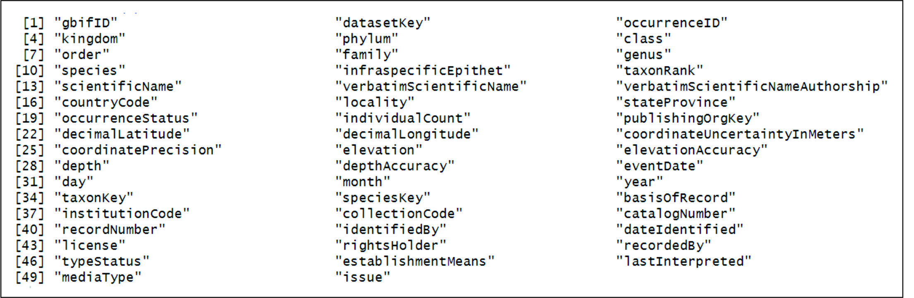

# Downloading species occurrence data from GBIF into R

This is a short tutorial on how we can download data from GBIF.  
Here, I use the RGBIF package from r to obtain longitude and latitude data, as well as other information that may be relevant.

## Índice
- [First steps](#first-steps)
- [Searching for taxonkeys](#searching-for-taxonkeys)
- [Downloading data](#downloading-data)
- [Selecting and saving data](#selecting-and-saving-data)
- [Contato](#contato)

## First steps
- 1) It is necessary to register at https://www.gbif.org/.

- 2) Write down your login details:  
      GBIF_USER="XXXXXXX"  
      GBIF_PWD="12345678"  
      GBIF_EMAIL="XXXXXXXXX@XXXXXX.com.br"

- 3) Install the rgbif package.

```
install.packages("rgbif")
```

- 4) Set up your GBIF credentials in r environment:
 ```
usethis::edit_r_environ()
```
Paste your data (GBIF_USER, GBIF_PWD and GBIF_EMAIL) into .Renviron

     
## Searching for taxonkeys
Searching for the taxonkey for the species

## Downloading data
Download data for each unique taxonkey
```python
# Seu código Python aqui

```

## Selecting and saving data


## Contato


Para mais informações, entre em contato comigo em meu endereço de e-mail: douglas_biologo@yahoo.com.br
